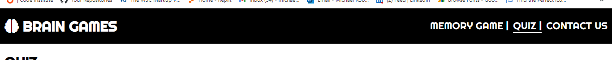

# Brain Games
(Developer: Michael Roberts)

[Live webpage] (https://mykki92.github.io/CI_PP2_BRAIN_GAMES/)
## Table of Contents
#
0. [Introduction](#introduction)
1. [Project Goals](#project-goals)
    1. [User Goals](#user-goals)
    2. [Site Owner Goals](#site-owner-goals)
2. [User Experience](#user-experience)
    1. [Target Audience](#target-audience)
    2. [User Requrements and Expectations](#user-requrements-and-expectations)
    3. [User Stories](#user-stories)
3. [Design](#design)
    1. [Design Choices](#design-choices)
    2. [Colour](#colours)
    3. [Fonts](#fonts)
    4. [Structure](#structure)
    5. [Wireframes](#wireframes)
4. [Technologies Used](#technologies-used)
    1. [Languages](#languages)
    2. [Frameworks & Tools](#frameworks-&-tools)
5. [Features](#features)
6. [Testing](#validation)
    1. [HTML Validation](#HTML-validation)
    2. [CSS Validation](#CSS-validation)
    3. [Accessibility](#accessibility)
    4. [Performance](#performance)
    5. [Device testing](#device-testing)
    6. [Browser compatibility](#browser-compatability)
    7. [Testing user stories](#testing-user-stories)
8. [Bugs](#Bugs)
9. [Deployment](#deployment)
10. [Credits](#credits)
11. [Acknowledgements](#acknowledgements)

## Introduction
Brain Games is a website that features logic, memory and knowledge based JavaScript games, targeted to users that want quick and fun games to play that will keep their mind active during a break at work for example. It is designed to be an interactive platform on which more and more games will be added over time to keep users interested and engaged.

## Project Goals 

The goal of this project is to create an interactive game platform featuring JavaScript games that are clearly presented, user friendly, engaging and challenging.

### User Goals

- To play games that are engaging and challenging
- Be able to learn something while playing 

### Site Owner Goals

- Develop an expandable Javascript game platform
- Provide fast and engaging content to users
- Make design simple and user-friendly
- Make games responsive and accessible
- Gain feedback from users

## User Experience

### Target Audience

- Users that want to be entertained and challenged
- Users with an interest in general knowledge
- Users with an interest in logic/memory based games

 
### User Requirements and Expectations

- Simple and attractive design
- Clear and simple instructions where necessary
- User friendly navigation and accessible features
- Responsiveness on range of devices and screen sizes
- Feedback from page to be clear and brief
- Means of contacting the developer
- Having an option to leave feedback

### User Stories

#### First-time User
1. As a first time user, I want the site to be easy to navigate and the features to be clearly presented
2. As a first time user, I want the game rules and controls to be easily understandable
3. As a first time user, I want the game to be engaging and interactive
4. As a first time user, I want the game to be challenging
5. As a first time user, I want to be able to see my progress through the game 

#### Returning User
6. As a returning user, I want to learn something playing the game
7. As a returning user, I want to be able to leave feedback with the developer
8. As a returning user, I want to know that my feedback has been sent

#### Site Owner
9. As the site owner, I want users to be able to interact with the site content with ease
10. As the site owner, I want users to be engaged and want to return to the site
11. As the site owner, I want users to feedback their experience with the site and any ideas for further development

## Design

The site is designed to be an engaging and interactive game platform, with simple and accessible features

### Design Choices

### Colour

Colour was kept to a minimum so as not to overload the screen when the user is playing the games. Using black text with a white background, contrast is kept to a minimum when the user is flipping the picture cards in the memory game. Color schemes for game buttons invert on hover so the user knows it is an interactive button.

### Fonts

The chosen font for this site is Righteous from Google Fonts, chosen for its easy readability and playful tone. Cursive was selected as the fallback font.

### Structure

The page is designed with a simple header featuring the logo icon, site name and navigation menu which is consistent across all pages. Below the header is a short section with an introduction to the game followed by a large game area that is the focus of the page, making both navigation of the pages and interaction with the games easily understandable and accessible.

### Wireframes

Memory Game

Quiz

Contact

## Technologies Used

### Languages
- HTML
- CSS
- JavaScript

### Frameworks & Tools
- Git
- GitHub
- Gitpod
- TinyPNG
- Balsamiq
- Google Fonts
- Font Awsome
- Favicon
- EmailJS
- AmIResponsive

## Features

### Logo and Navigation Bar
- Features on all pages.
- The navbar is fully responsive and and includes links to the Memory Game, Quiz and Contact Us page.
- It allows users to easily navigate the site.
- The link for the active page is underlined.
- User stories covered: 1, 9

### Memory Game
- Interactive and engaging memory game where the user must flip the cards by clicking them to find the matches.
- Introduced with a quote and some basic instructions for the game.
- User stories covered: 1, 2, 3, 4, 5, 10

### Quiz
- Quiz featuring ten history, geography and space based questions to test the users knowledge.
- Introduced with a quote and some basic instructions for the quiz.
- User stories covered: 1, 2, 3, 4, 6, 10

### Hover buttons and score tally
- The answer buttons feature a hover function to change their color scheme so the user can easily identify their answer choice before clicking.
- The quiz keeps a running score and question counter as you progress through the quiz.
- User stories covered: 2, 3, 5, 9

### Final Score
- Once the quiz has been completed, a congratulatory message will be displayed with the user's final score and a button to restart the quiz.
- User stories covered: 2, 3, 5, 9

### Contact Form
- Allows the user to leave feedback regarding their experience so far and suggestions for what they'd like to see on the site.
- User stories covered: 7, 10, 11

### Feedback Message
- Once the user has input their details and comments to the form and pressed the submit button, a message will appear informing the user that their feedback has been submitted.
- A button labelled OK at the bottom of the message will refresh the page so the user can send another comment or navigate to other pages on the site.
- User stories covered: 8, 9, 11

## Validation

### HTML Validation
The W3C Markup Validation Service was used to validate the HTML of the website. All pages pass with no errors no warnings to show.

Quiz

### CSS Validation
The W3C Jigsaw CSS Validation Service was used to validate the CSS of the website. All CSS passed with no errors or warnings to show.

Whole Page

style.css

### JavaScript Validation

### Accessibility
The WAVE WebAIM web accessibility evaluation tool was used to ensure the website met high accessibility standards. All pages pass with 0 errors.

Memory Game

Quiz

Contact Us

### Performance
Google Lighthouse in Google Chrome Developer Tools was used to test the performance of the website. 

Memory Game

Quiz

Contact Us

### Device testing
The website was tested on the following devices:
- Google Pixel 7
- Samsung Galaxy A7 Lite Tab
- HP Laptop 14
- Apple iMac

### Browser compatability
The website was tested on the following browsers:
- Google Chrome
- Microsoft Edge
- Mozilla Firefox
- Safari

### Testing user stories

1. As a first time user, I want the site to be easy to navigate and the features to be clearly presented.

| **Feature** | **Action** | **Expected Result** | **Actual Result** |
|-------------|------------|---------------------|-------------------|
| Logo and Navigation Bar | Find at the top of any page | Find navigation options for the site pages | Works as expected |
| Memory Game | Navigate to the Memory Game page | Find the game ready to play with instructions | Works as expected |
| Quiz | Navigate to the Quiz page | Find the quiz ready to play with instructions | Works as expected |

2. As a first time user, I want the game rules and controls to be easily understandable.

| **Feature** | **Action** | **Expected Result** | **Actual Result** |
|-------------|------------|---------------------|-------------------|
| Memory Game | Navigate to the Memory Game page | Find the game ready to play with instructions | Works as expected |
| Quiz | Navigate to the Quiz page | Find the quiz ready to play with instructions | Works as expected |
| Hover Buttons and Score Tally | Hover mouse over answer options in the quiz | Easily identify your chosen answer due to change in color scheme of the button | Works as expected |
| Final Score | Complete all quiz questions | See a message appear showing you your final score with a button to restart the quiz | Works as expected |

3. As a first time user, I want the game to be engaging and interactive.

| **Feature** | **Action** | **Expected Result** | **Actual Result** |
|-------------|------------|---------------------|-------------------|
| Memory Game | Click on cards to flip and search for match | The game features attractive patterns and images on the game cards with a function to flip the cards with a mouse click| Works as expected |
| Quiz | Answer questions in the quiz | The quiz features interesting questions in a simple and appealing layout | Works as expected |
| Hover Buttons and Score Tally | Hover mouse over answer options in the quiz | Easily interact with the quiz and see your progress throughout | Works as expected |
| Final Score | Complete all quiz questions | Shows your final score with a button to restart the quiz if you'd like to try and improve your score | Works as expected |

4. As a first time user, I want the game to be challenging.

| **Feature** | **Action** | **Expected Result** | **Actual Result** |
|-------------|------------|---------------------|-------------------|
| Memory Game | Click on cards to flip and search for match | The game tests the users memory with a deck made up of 18 cards that are placed randomly each time the board is refreshed | Works as expected |
| Quiz | Answer questions in the quiz | The quiz features interesting questions on lesser known subjects to test and expand the user's knowledge | Works as expected |

5. As a first time user, I want to be able to see my progress through the game.

| **Feature** | **Action** | **Expected Result** | **Actual Result** |
|-------------|------------|---------------------|-------------------|
| Memory Game | Click on cards to flip and search for match | When a pair of matching cards are found they will remain flipped until all matches are found and the deck is completely flipped | Works as expected |
| Hover Buttons and Score Tally | Answer questions in the quiz | Shows the user their tally of correct answers out of the maximum of 10 | Works as expected |
| Final Score | Complete all quiz questions | Shows the user their final score once the quiz is complete | Works as expected |

6. As a returning user, I want to learn something playing the game.

| **Feature** | **Action** | **Expected Result** | **Actual Result** |
|-------------|------------|---------------------|-------------------|
| Memory Game | Click on cards to flip and search for match | This game will test and improve the user's memory skills | Works as expected |
| Quiz | Answer questions in the quiz | This quiz will test and improve the user's knowledge on the given subjects | Works as expected |

7. As a returning user, I want to be able to leave feedback with the developer.

| **Feature** | **Action** | **Expected Result** | **Actual Result** |
|-------------|------------|---------------------|-------------------|
| Contact Form | Navigate to Contact Us page | Fill out your details and comments and submit your feedback | Works as expected |

8. As a returning user, I want to know that my feedback has been sent.

| **Feature** | **Action** | **Expected Result** | **Actual Result** |
|-------------|------------|---------------------|-------------------|
| Feedback Message | Submit your feedback | See a message appear confirming your feedback has been submitted | Works as expected |

9. As the site owner, I want users to be able to interact with the site content with ease.

| **Feature** | **Action** | **Expected Result** | **Actual Result** |
|-------------|------------|---------------------|-------------------|
| Logo and Navigation Bar | Find at the top of any page | Find navigation options for the site pages | Works as expected |
| Hover Buttons and Score Tally | Hover mouse over answer options in the quiz | Easily interact with the quiz and see your progress throughout | Works as expected |
| Final Score | Complete all quiz questions | Shows your final score with a button to restart the quiz if you'd like to try and improve your score | Works as expected |
| Feedback Message | Submit your feedback | See a message appear confirming your feedback has been submitted | Works as expected |

10. As the site owner, I want users to be engaged and want to return to the site.

| **Feature** | **Action** | **Expected Result** | **Actual Result** |
|-------------|------------|---------------------|-------------------|
| Memory Game | Click on cards to flip and search for match | The game features attractive patterns and images on the game cards with a function to flip the cards with a mouse click| Works as expected |
| Quiz | Answer questions in the quiz | The quiz features interesting questions in a simple and appealing layout | Works as expected |
| Contact Form | Navigate to Contact Us page | User can send feedback to the developer to let them know if any features or games they'd like to see added to the site | Works as expected |

11. As the site owner, I want users to feedback their experience with the site and any ideas for further development.

| **Feature** | **Action** | **Expected Result** | **Actual Result** |
|-------------|------------|---------------------|-------------------|
| Contact Form | Navigate to Contact Us page | User can send feedback to the developer to let them know if any features or games they'd like to see added to the site | Works as expected |
| Feedback Message | User submits feedback | User sees a message appear confirming their feedback has been submitted | Works as expected |

## Bugs

| **Bug** | **Fix** |
| ----------- | ----------- |
| Memory game cards cannot be flipped again after game has been won and restarted | Enclose game variables and functions inside a function called startGame() and call that function when restart button is pressed |

## Deployment
The website was deployed using GitHub Pages by following these steps:
1. In the GitHub repository navigate to the Settings tab
2. On the left hand menu select Pages
3. For the source select Branch: master
4. After the webpage refreshes automaticaly you will see a ribbon on the top saying: "Your site is published at https://mykki92.github.io/CI_PP2_BRAIN_GAMES/"

You can fork the repository by following these steps:
1. Go to the GitHub repository
2. Click on Fork button in upper right hand corner

You can clone the repository by following these steps:
1. Go to the GitHub repository 
2. Locate the Code button above the list of files and click it 
3. Select if you prefere to clone using HTTPS, SSH, or Github CLI and click the copy button to copy the URL to your clipboard
4. Open Git Bash
5. Change the current working directory to the one where you want the cloned directory
6. Type git clone and paste the URL from the clipboard ($ git clone https://github.com/YOUR-USERNAME/YOUR-REPOSITORY)
7. Press Enter to create your local clone.

## Credits

### Media
Images courtesy of Shutterstock.com:
- [bear](assets/images/bear.jpg)
- [card-back](assets/images/card-back.jpg)
- [dolphin](assets/images/dolphin.jpg)
- [elephant](assets/images/elephant.jpg)
- [gorilla](assets/images/gorilla.jpg)
- [kitten](assets/images/kitten.jpg)
- [red-panda](assets/images/red-panda.jpg)
- [tiger](assets/images/tiger.jpg)
- [wolf](assets/images/wolf.jpg)

Images courtesy of Pexels.com:
- [penguins](assets/images/penguins.jpg)

## Acknowledgements
- My Code Institute Mentor Mo Shami for his guidance and advice.
- Code Institute learning modules and tutor support.
- W3 Schools
- GitHub tutorials