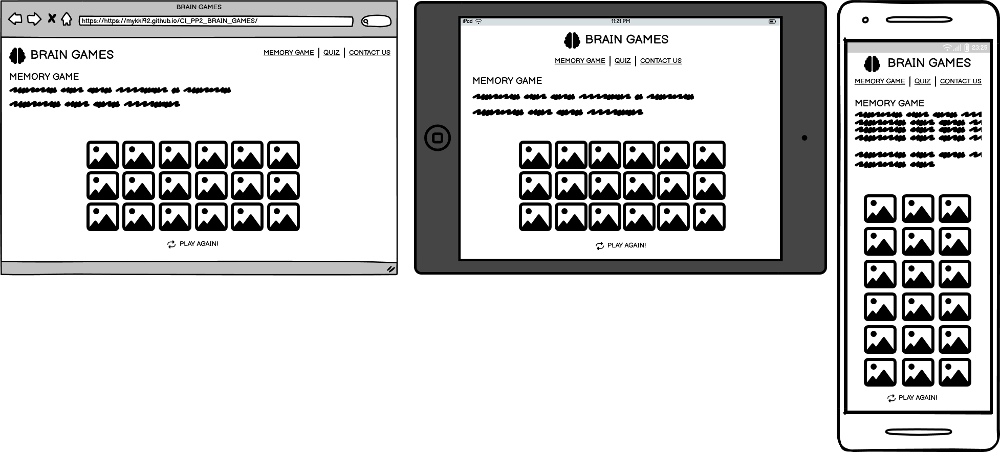

# Brain Games
(Developer: Michael Roberts)

[Live webpage] (https://mykki92.github.io/CI_PP2_BRAIN_GAMES/)
## Table of Contents

1. [Project Goals](#project-goals)
    1. [User Goals](#user-goals)
    2. [Site Owner Goals](#site-owner-goals)
2. [User Experience](#user-experience)
    1. [Target Audience](#target-audience)
    2. [User Requrements and Expectations](#user-requrements-and-expectations)
    3. [User Stories](#user-stories)
3. [Design](#design)
    1. [Design Choices](#design-choices)
    2. [Colour](#colours)
    3. [Fonts](#fonts)
    4. [Structure](#structure)
    5. [Wireframes](#wireframes)
4. [Technologies Used](#technologies-used)
    1. [Languages](#languages)
    2. [Frameworks & Tools](#frameworks-&-tools)
5. [Features](#features)
6. [Testing](#validation)
    1. [HTML Validation](#HTML-validation)
    2. [CSS Validation](#CSS-validation)
    3. [Accessibility](#accessibility)
    4. [Performance](#performance)
    5. [Device testing](#device-testing)
    6. [Browser compatibility](#browser-compatability)
    7. [Testing user stories](#testing-user-stories)
8. [Bugs](#Bugs)
9. [Deployment](#deployment)
10. [Credits](#credits)
11. [Acknowledgements](#acknowledgements)

## Project Goals 

### User Goals
### Site Owner Goals

## User Experience

### Target Audience

### User Requirements and Expectations

### User Stories

#### First-time User

#### Returning User

#### Site Owner

## Design

### Design Choices

### Colour

### Fonts

### Structure

### Wireframes

Memory Game

Quiz

Contact

## Technologies Used

### Languages
- HTML
- CSS
- JavaScript

### Frameworks & Tools
- Git
- GitHub
- Gitpod
- TinyPNG
- Balsamiq
- Google Fonts
- Font Awsome
- Favicon

## Features

## Validation

### HTML Validation

### CSS Validation

### JavaScript Validation

### Accessibility

### Performance

### Device testing

### Browser compatability

### Testing user stories

## Bugs

| **Bug** | **Fix** |
| ----------- | ----------- |
| Memory game cards cannot be flipped again after game has been won and restarted | Enclose game variables and functions inside a function called startGame() and call that function when restart button is pressed |

## Deployment
The website was deployed using GitHub Pages by following these steps:
1. In the GitHub repository navigate to the Settings tab
2. On the left hand menu select Pages
3. For the source select Branch: master
4. After the webpage refreshes automaticaly you will see a ribbon on the top saying: "Your site is published at https://mykki92.github.io/CI_PP2_BRAIN_GAMES/"

You can fork the repository by following these steps:
1. Go to the GitHub repository
2. Click on Fork button in upper right hand corner

You can clone the repository by following these steps:
1. Go to the GitHub repository 
2. Locate the Code button above the list of files and click it 
3. Select if you prefere to clone using HTTPS, SSH, or Github CLI and click the copy button to copy the URL to your clipboard
4. Open Git Bash
5. Change the current working directory to the one where you want the cloned directory
6. Type git clone and paste the URL from the clipboard ($ git clone https://github.com/YOUR-USERNAME/YOUR-REPOSITORY)
7. Press Enter to create your local clone.

## Credits

### Media
Images courtesy of Shutterstock.com:
- [bear](assets/images/bear.jpg)
- [card-back](assets/images/card-back.jpg)
- [dolphin](assets/images/dolphin.jpg)
- [elephant](assets/images/elephant.jpg)
- [gorilla](assets/images/gorilla.jpg)
- [kitten](assets/images/kitten.jpg)
- [red-panda](assets/images/red-panda.jpg)
- [tiger](assets/images/tiger.jpg)
- [wolf](assets/images/wolf.jpg)

Images courtesy of Pexels.com:
- [penguins](assets/images/penguins.jpg)

## Acknowledgements
- My Code Institute Mentor Mo Shami for his guidance and advice.
- Code Institute learning modules and tutor support.
- W3 Schools
- GitHub tutorials